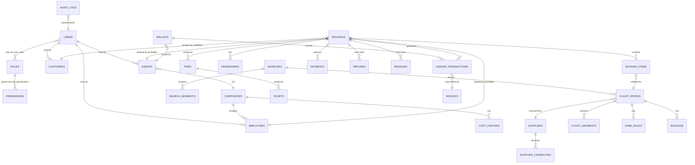

# MUHAMMAD TOURS AND TRAVELS — Database Architecture

Engine: PostgreSQL. Conventions: UUID primary keys, explicit foreign keys,
indexes on all FK and lookup columns, `check` constraints for enums/state
values, `created_at`/`updated_at` on every table, soft-delete
(`deleted_at`) on user-facing entities, all schema changes via versioned
migrations (no manual production DDL).

---

## Simplified core-domain ER diagram

This shows the load-bearing relationships only (identity, booking,
ticketing, money). Full entity list with every field is below; hotel,
visa, package, CRM and notification tables follow the same conventions
and are omitted here for readability.

*(Exactly one of `agents` / `customers` / `employees` is set per booking —
enforced with a check constraint, not application logic alone.)*

---

## Entity groups (full table list)

**Identity & access**
`users`, `roles`, `permissions`, `user_roles`, `role_permissions`,
`sessions`/`refresh_tokens`.

**Commercial actors**
`agents`, `customers`, `corporates`, `departments`, `employees`,
`cost_centers`, `travel_policies`.

**Supplier & reference data**
`suppliers`, `supplier_capabilities` (capability matrix — see
`SUPPLIER-INTEGRATION.md`), `airlines`, `airports`.

**Search & offers**
`searches`, `search_segments`, `flight_offers`, `flight_segments`,
`fare_rules`, `baggage`.

**Booking & ticketing**
`bookings`, `booking_items`, `passengers`, `pnrs`, `tickets`.

**Payments & money**
`payments`, `refunds`, `reissues`, `wallets`, `ledger_transactions`,
`markups`, `commissions`, `invoices`.

**Hotel**
`hotels`, `hotel_rooms`, `hotel_bookings`.

**Visa**
`visa_applications`, `visa_documents`.

**Packages**
`packages`, `package_items`.

**CRM & notifications**
`crm_records`, `notifications`, `notification_templates`.

**Governance**
`audit_logs`.

---

## Design decisions worth calling out

### 1. The ledger is append-only

`ledger_transactions` is never updated after insert. A wallet's current
balance is a *derived* value (sum of its transactions, or a maintained
running total that is re-derivable from the transaction log if it ever
drifts). Every row carries `previous_balance` and `new_balance` at the
time it was written, so a balance can be reconstructed and audited
independent of the current `wallets.balance` cache column. This is what
Section 15 of the brief calls for, and it's the only pattern that survives
an audit or a support dispute ("why is my balance wrong") without
guesswork.

### 2. Identifiers are never conflated

Separate columns/tables for: `search_id`, `offer_id` (ephemeral,
cache-backed, expires), `booking_id` (ours), `supplier_booking_id`
(theirs — one booking can have several, one per supplier involved),
`pnr` (airline/GDS-issued), `ticket_number`, `payment_id`, `invoice_id`.
A `booking` can have multiple `pnrs` (multi-supplier itineraries), and
each `pnr` can have multiple `tickets` (multiple passengers).

### 3. Raw supplier payloads are preserved

`flight_offers` and `booking_items` carry a `source_reference` /
`raw_payload jsonb` column holding the unmodified supplier response
alongside the normalized fields. This is what makes repricing, dispute
resolution, and "why did this offer disappear" debugging possible without
re-calling the supplier.

### 4. Soft delete is selective

Soft-delete (`deleted_at`) applies to user-facing, correctable records
(e.g. a draft package, a CRM note). It never applies to financial or
booking-state records — those are corrected via a new, linked transaction
(a `refund` row, a `reissue` row, a reversing `ledger_transaction`), never
by deleting or mutating history.

### 5. Passenger PII is isolated

`passengers` (name, DOB, passport data, contact info) sits in its own
table with tighter column-level access controls than the rest of the
schema, and passport scans live in encrypted object storage (referenced
by pointer, never stored as a blob in Postgres). See `SECURITY.md` §
Data Protection.
