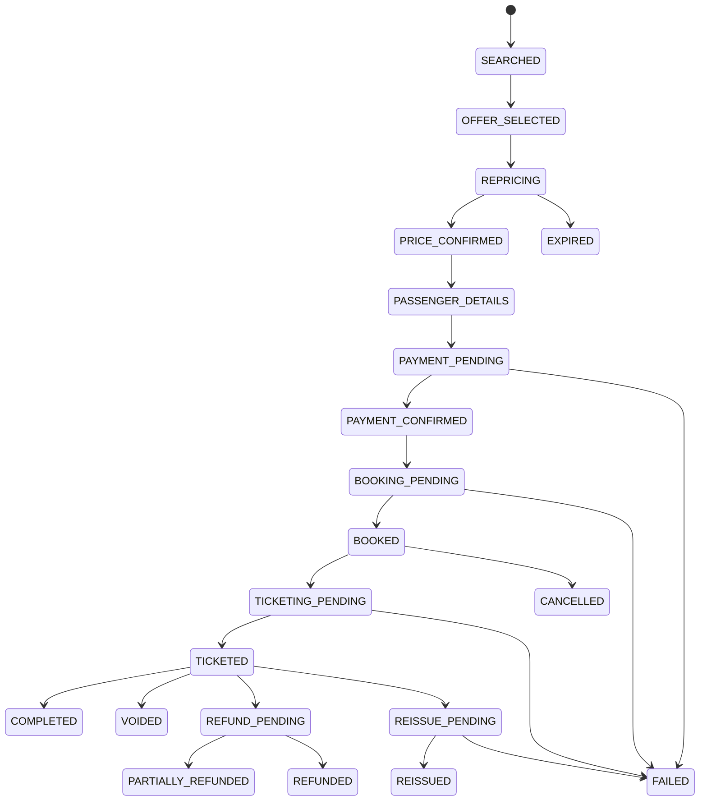

# MUHAMMAD TOURS AND TRAVELS — Supplier Integration & Flight Engine

## Supplier policy (binding)

Suppliers are integrated **only** through official APIs, approved partner
APIs, official SDKs, contractually permitted interfaces, or authorized
GDS/NDC connections. No scraping, no CAPTCHA bypass, no unauthorized
credential automation, ever — regardless of how convenient it would be.
Where a supplier has no usable API yet, the adapter exists with a
`MockSupplier` implementation behind it, clearly labeled as mock in every
response payload (`meta.mock: true`) so mock and live data are never
ambiguous downstream.

## G. Supplier adapter interface

```ts
interface SupplierAdapter {
  readonly supplierId: string;
  readonly capabilities: SupplierCapability[];

  searchFlights(query: FlightSearchQuery): Promise<RawSupplierOffer[]>;
  repriceFlight(offer: RawSupplierOffer): Promise<RepriceResult>;
  createBooking(offer: RawSupplierOffer, passengers: Passenger[]): Promise<SupplierBookingResult>;
  retrieveBooking(supplierBookingId: string): Promise<SupplierBookingStatus>;
  issueTicket(supplierBookingId: string): Promise<TicketIssueResult>;
  cancelBooking(supplierBookingId: string): Promise<CancelResult>;
  voidTicket(ticketNumber: string): Promise<VoidResult>;
  refundBooking(ticketNumber: string): Promise<RefundResult>;
  reissueTicket(ticketNumber: string, changes: ReissueRequest): Promise<ReissueResult>;
  getFareRules(offer: RawSupplierOffer): Promise<FareRules>;
  getSeatAvailability(offer: RawSupplierOffer): Promise<SeatMap>;
  getBaggage(offer: RawSupplierOffer): Promise<BaggageInfo>;
  getBookingStatus(supplierBookingId: string): Promise<SupplierBookingStatus>;
}
```

Each adapter declares which capabilities it actually supports; the
orchestrator checks the capability matrix before calling a method, and
fails predictably (a typed `UnsupportedOperationError`, not a crash) if
asked to do something a given supplier can't do.

### Capability matrix (illustrative)

| Supplier | SEARCH | REPRICE | BOOK | TICKET | VOID | REFUND | REISSUE | SEAT | BAGGAGE |
|---|:---:|:---:|:---:|:---:|:---:|:---:|:---:|:---:|:---:|
| B2B Supplier 1 | ✅ | ✅ | ✅ | ✅ | ✅ | ✅ | – | ✅ | ✅ |
| B2B Supplier 2 | ✅ | ✅ | ✅ | ✅ | – | – | – | – | ✅ |
| B2B Supplier 3 | ✅ | ✅ | ✅ | ✅ | ✅ | ✅ | ✅ | ✅ | ✅ |
| B2B Supplier 4 | ✅ | ✅ | ✅ | – | – | – | – | – | ✅ |
| B2B Supplier 5 | ✅ | – | ✅ | ✅ | ✅ | ✅ | – | ✅ | ✅ |
| Amadeus (GDS) | ✅ | ✅ | ✅ | ✅ | ✅ | ✅ | ✅ | ✅ | ✅ |
| Mock Supplier | ✅ | ✅ | ✅ | ✅ | ✅ | ✅ | ✅ | ✅ | ✅ |

(Real values are populated once each supplier's documentation confirms
what it actually exposes — this table drives runtime behavior, so it must
never be guessed.)

## F. Search orchestration pipeline ("ONE SEARCH")

```
FlightSearchService.search(query)
        │
        ▼
SearchOrchestrator
        │  fan out in parallel, per-supplier timeout (e.g. 4–6s)
        ▼
┌─────────┬─────────┬─────────┬─────────┬─────────┬─────────┐
│  S1     │   S2    │   S3    │  S4/S5  │ Amadeus │  (more) │
│ SUCCESS │ TIMEOUT │ SUCCESS │  ERROR  │ SUCCESS │   ...   │
└─────────┴─────────┴─────────┴─────────┴─────────┴─────────┘
        │  (timed-out/errored suppliers are logged + skipped, not fatal)
        ▼
   Normalizer        → maps every raw response to the unified Flight Offer model
        ▼
   Validator          → discards structurally invalid offers, flags for monitoring
        ▼
   Deduplication      → fingerprint-based merge (see below)
        ▼
   Pricing Engine     → applies markup/fee/discount rules
        ▼
   Fare Rule Engine   → attaches refundability/change rules per offer
        ▼
   Ranking Engine     → price, then configurable weighting (duration, stops, supplier reliability)
        ▼
   Unified Flight Offers → returned to frontend, streamed as suppliers respond
```

The frontend receives offers incrementally (via WebSocket or long-poll) so
a slow supplier doesn't delay the ones that already responded — "one
supplier must never freeze the entire search" (per the brief) is enforced
here, not left to hope.

## E. Unified Flight Offer model

`supplier`, `supplierOfferId`, `airline`/`airlineCode`, `flightNumber`,
`marketingCarrier`, `operatingCarrier`, `origin`, `destination`,
`departure`, `arrival`, `duration`, `stops`, `segments[]`, `aircraft`,
`cabin`, `bookingClass`, `fareFamily`, `baseFare`, `taxes`, `fees`,
`totalFare`, `currency`, `baggage`, `carryOn`, `fareRules`,
`refundability`, `changeability`, `seatAvailability`,
`ticketingDeadline`, `fareExpiry`, `validatingCarrier`,
`sourceReference` (pointer to the raw payload). Extra, supplier-specific
fields ride along in a `raw` bag rather than being dropped — this is what
lets the model absorb NDC's richer offer/order content later without a
breaking schema change.

## Deduplication

Fingerprint = `marketingCarrier + operatingCarrier + flightNumber +
origin + destination + departure + arrival + segments + cabin +
fareFamily`. Offers sharing a fingerprint are **candidates** for merging,
not automatically merged — they're compared on price, baggage, fare
rules, refundability, change rules, ticketing deadline, and supplier
reliability score before the best valid one is selected and the rest
suppressed (kept in the raw result set for audit, not deleted). Offers
that differ materially on any of those dimensions are kept as distinct
results even if the flight itself is identical — a materially worse fare
condition is not a duplicate, it's a worse option.

## I. Pricing engine

```
supplierPrice + markup + serviceFee + ancillary - discount = customerPrice
```

Markup/fee/discount rules are evaluated by specificity, most specific
wins (agent-specific > corporate-specific > route+airline > airline >
route > global default), and can be fixed or percentage, with optional
min/max caps. Internal cost breakdowns are never exposed to B2C
customers; B2B/corporate views may show more detail depending on their
contract terms and permission scope.

## Fare validation (search is not booking)

```
SEARCH → SELECT OFFER → REPRICE → AVAILABILITY CHECK → FARE RULE CHECK
   → PRICE CONFIRMATION → PASSENGER DETAILS → PAYMENT → BOOKING → TICKETING
```

If reprice returns a different price than search showed, the user sees
old price, new price, and the difference, and must explicitly confirm
before the flow continues — silent repricing is not acceptable in a
travel booking flow.

## H. Booking state machine



Every transition is written to a `booking_state_transitions` log (from
state, to state, actor, timestamp, reason) — the current state on the
`bookings` row is a cache of the latest transition, not the only record
of it, so a support agent can always answer "what happened to this
booking and when."

## Mock mode

`MockFlightSupplier`, `MockPaymentProvider`, `MockNotificationProvider`,
`MockHotelSupplier`, `MockVisaProvider` implement the same interfaces as
real integrations, return realistic (clearly synthetic) data, and are
what Phase 1–2 development and demos run against. Real integrations are
added behind the same interfaces when credentials and documentation are
available — application code above the adapter layer does not change
when a mock is swapped for a live connection.
